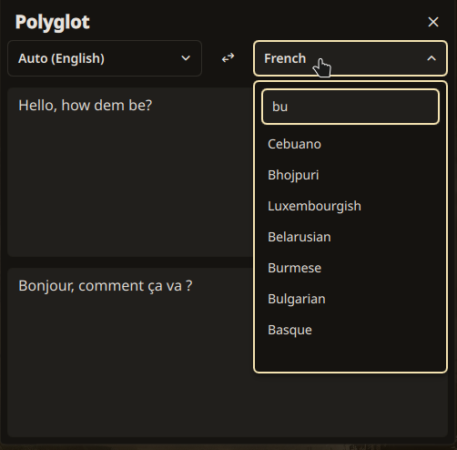

# Polyglot

Polyglot is a WIP widget for [Dank Material Shell](https://danklinux.com) that lets you quickly translate some snippets from one language to another, as you would do it on Google Translate's or DeepL's websites.

## Features

- Translate text as you type
- Dozens of languages supported through DeepL's service
- Support for source language autodetection

## Limitations

- Currently, only DeepL's free API is supported. LibreTranslate will probably be added in the future. Others can be added upon issue/pull request.
- DeepL's API is somewhat limited compared to the website version. In particular, there is no dictionary (i.e. grammar and example of phrases when the input only contains one word), and no list of alternatives for translation.
- The plugin is very young. Do not hesitate to report bugs/ask for features!
